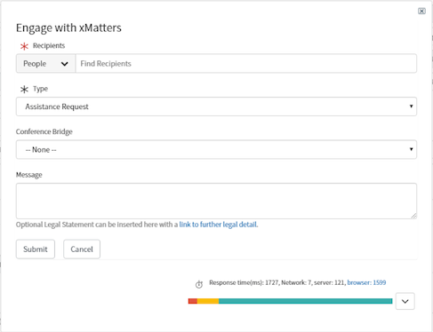
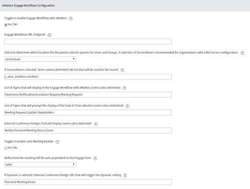
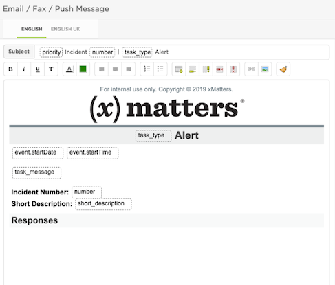

# Engage Workflow

## Features
* Leverage xMatters Engage from any table in ServiceNow
* Configurable xMatters Engage form from a configuration page
* Dynamic and responsive field selection on the xMatters Engage form
* Organizations can leverage the Type field to drive different actions and behaviors in xMatters (i.e. Assistance Required, Meeting Request, Slack Chat, etc.)
* Ability to auto-populate the External Conference Bridge Passcode and Meeting Room link by user profile
* Out of box support for Incident table, but can be configured for any other tables.

## Preview
### With Date and Time and External Conference Bridge Selected:

### Assistance Request no meeting date time and conference bridge:

### Empty form:

## Configurations Overview

### Passcode and Meeting Link Relationship
Search for Engage Workflow meetings in the navigation to configure. For non-administrators to see this view they must possess the `x_xma_xmatters_engage_workflow_meeting` role.

### ServiceNow Configuration for Different Tables
Out of box this feature supports the Incident module. There are two steps to configure this for additional tables.

#### Step 1: Configure the UI Action
This configuration step documents the process to make this Engage button available on the new table. Find **Engage Workflow - xMatters** > **UI Actions** > **xMatters Engage**. Once open, update the field **Table** to the newly desired table and then on the ribbon at the top, right-click and select **Insert and Stay**. By selecting **Insert and Stay**, this will create a new UI Action without impacting the existing on the Incident table.

Recommended to name as the following for the navigation link to work: **xMatters Engage**

Once the above has been completed, navigate to the table selected (or search <table_name>.LIST in the navigation it will open a new tab) and confirm the existence of the button.

#### Step 2: Configure the Relationship for Related Lists
To configure a Related List to make it viewable

Recommended to name as the following for the navigation link to work: **xMatters Engage Workflow**

Be sure when adding the Related List to the new table to select as below (i.e. do not add the one with Parent in the name)

#### xMatters Configuration for different tables

As an xMatters developer, a user can account or handle the different tables by leveraging data in the JSON submission. For each submission there will be a JSON property named `sys_class_name`. This table will provide users to leverage Flow Designer using a Switch Statement. This can assist with handling the corresponding notification action in xMatters.

The outbound integrations require no changes whatsoever to account for this new table. Since the sys_id is being passed back it will know to update the corresponding table.

### xMatters Communication Plan forms
Users can modify the HTML to adjust the color schemes to meet the organizations branding as well as include an updated image.

#### Engage with xMatters Template

#### Conference Bridge Template

### Development Roadmap
* Ability to create a specific configuration per table. I.e. Incident has the ability to display `x` values in the Type drop-down, where Change Request has others, and so on. This would also support different endpoints so they're not all targeting the same endpoints.
