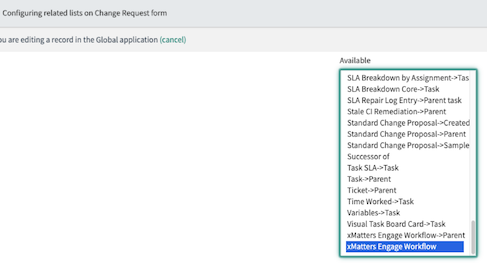

# Engage Workflow

## Features
* Leverage xMatters Engage from any table in ServiceNow
* Configurable xMatters Engage form from a configuration page
* Dynamic and responsive field selection on the xMatters Engage form
* Organizations can leverage the Type field to drive different actions and behaviors in xMatters (i.e. Assistance Required, Meeting Request, Slack Chat, etc.)
* Ability to auto-populate the External Conference Bridge Passcode and Meeting Room link by user profile
* Out of box support for Incident table, but can be configured for any other tables.

## Overview
### Conference Bridge Alert

Download and watch: [media/conf-bridge-demo.mov](media/conf-bridge-demo.mov)

### Engage with xMatters Event

Download and watch: [media/engage-demo.mov](media/engage-demo.mov)

## Install
1.) From within ServiceNow import the update set: [Update Set](ServiceNow Update Set/xMatters Engage Workflow v1.4.xml)
2.) Import the xMatters communication plan into xMatters: [Communication Plan](xMatters Communication Plan/xMattersEngage.zip)
3.) Configure the integration from within ServiceNow
4.) Configure the integration from within xMatters by updating **Edit Endpoints**

### Configurations
To configure the new component navigate to **Engage Workflow - xMatters** > **Engage Workflow Configuration**.

Below are the list of configurations available from within the **Engage Workflow Configuration**:
* Toggle to enable Engage Workflow with xMatters: Yes/No
* Engage Workflow URL Endpoint: URL Endpoint for initial handling of submission
* Select to determine which location the Recipients selector queries for Users and Groups. A selection of ServiceNow is recommended for organizations with a Mid Server configuration: ServiceNow/xMatters
* If ServiceNow is selected. Semi-comma delimited role list that will be used for the search
* List of Types that will display in the Engage Workflow with xMatters (semi-colon delimited)
* List of Types that will prompt the display of the Date & Time selection (semi-colon delimited)
* External Conference Bridges that will display (semi-colon delimited)
* Toggle to enable auto Meeting Builder: Provides the ability to enable the dynamic meeting population.
* Define how the meeting will be auto-populated on the Engage form: table/dynamic
* If Dynamic is selected, the External Conference Bridge URL that will trigger the dynamic setting: Enter one of the External Conference Bridges that will trigger the process.
* If Dynamic is selected, this is the base URL that will display: base URL i.e. `https://meeting-site.xyz.com/join/`
* If Dynamic is selected, this is how the meeting will be auto populated (i.e. https://meeting-site.xyz.com/join/): user_name/first_name.last_name/none
* Toggle to enable xMatters Hosted Conference Bridges in the Engage display.
* Legal Statement: Optional legal statement field which accepts HTML formatted links
* Moment Format for the Date Time field. Please refer to the documentation here: https://momentjs.com/ What is entered here will be what's included in: moment().tz('America/New_York').format('HERE')
* Moment TimeZone Conversion for the Date Time field. Please refer to the documentation here: https://momentjs.com/timezone/. What's entered below is what's populated: moment().tz('HERE').format('lll')

### Passcode and Meeting Link Relationship
Search for Engage Workflow meetings in the navigation to configure. For non-administrators to see this view they must possess the `x_xma_xmatters_engage_workflow_meeting` role.

### ServiceNow Configuration for Different Tables
Out of box this feature supports the Incident module. There are two steps to configure this for additional tables.

#### Step 1: Configure the UI Action
This configuration step documents the process to make this Engage button available on the new table. Find **Engage Workflow - xMatters** > **UI Actions** > **Engage Workflow List**. Once open select the existing Engage Workflow record, update the **Table** field to the newly desired table and then on the ribbon at the top, right-click and select **Insert and Stay**. By selecting **Insert and Stay**, this will create a new UI Action without impacting the existing on the Incident table.

It is recommended to name the UI Action as the following for the navigation link to continue working: **xMatters Engage**

Once the above has been completed, navigate to the table selected (or search <table_name>.LIST in the navigation it will open a new tab) and confirm the existence of the button.

#### Step 2: Configure the Relationship for Related Lists
To configure a Related List to make it viewable, search for **Engage Workflow - xMatters** > **Relationships** > **Engage Workflow List**. Once open select the existing Engage Workflow record, update the **Table** field to the newly desired table and then on the ribbon at the top, right-click and select **Insert and Stay**.

It is recommended to name the Relationship for the navigation link to work: **xMatters Engage Workflow**

To add the Related List to the new table refer to the instructions [here](https://support.xmatters.com/hc/en-us/articles/115004327803-ServiceNow-integration-version-5-1-#add_related_list).

Be sure when adding the Related List to the new table to select as below (i.e. do not add the one with Parent in the name)

#### xMatters Configuration for different tables

As an xMatters developer, a user can account or handle the different tables by leveraging data in the JSON submission. For each submission there will be a JSON property named `sys_class_name`. This table will provide users to leverage Flow Designer using a Switch Statement. This can assist with handling the corresponding notification action in xMatters.

The outbound integrations require no changes whatsoever to account for this new table. Since the sys_id is being passed back it will know to update the corresponding table.

### xMatters Communication Plan forms
Users can modify the HTML to adjust the color schemes to meet the organizations branding as well as include an updated image.

#### Engage with xMatters Template

#### Conference Bridge Template

### Development Roadmap
* Ability to create a specific configuration per table. I.e. Incident has the ability to display `x` values in the Type drop-down, where Change Request has others, and so on. This would also support different endpoints so they're not all targeting the same endpoints.
